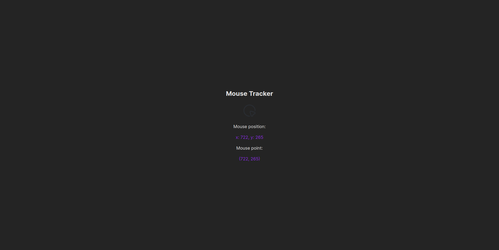

# Mouse Tracker

This template provides a minimal setup to get React working in Vite with HMR and some ESLint rules.



> You should use Node 18.x and latest

### Setup

1. Clone the repository:

   ```bash
   git clone https://github.com/turbolukoshko/mouse-tracker.git
   ```

2. Navigate to the project directory:

   ```bash
   cd mouse-tracker
   ```

3. Install dependencies:

   ```bash
   npm install
   ```

4. Run project:

   ```bash
   npm run dev
   ```
